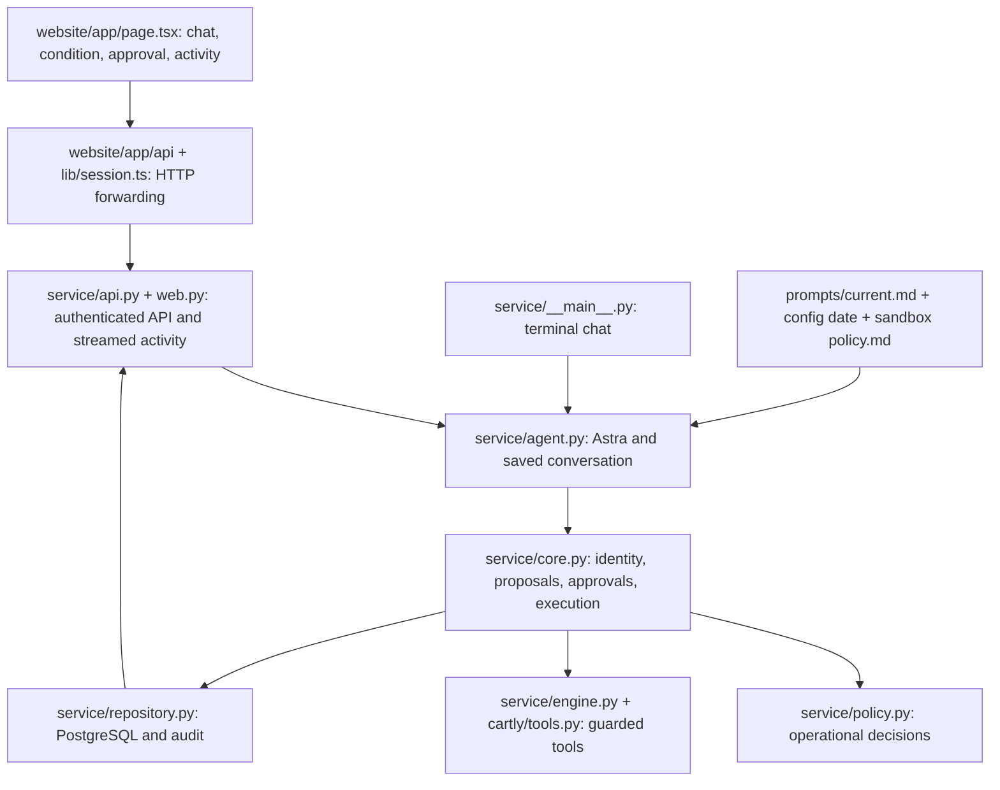

# Cartly — one local codebase

The website and terminal now call the **same Python agent and guarded service**.
Python owns conversations, policy decisions, tools, approvals, and PostgreSQL state.
The website displays messages and activity and forwards requests; it has no agent,
policy calculator, or world-data copy.

**Deployment status:** this consolidation is local only. The public site still
runs its previously published version. No GitHub push or production switch was
performed. Choose a Python/PostgreSQL host before publishing this frontend.

## Start the product

Dependencies are installed on this laptop. From this folder:

```sh
.venv-service/bin/python scripts/dev.py --enable-model
```

Open http://127.0.0.1:5173. This explicitly enables paid Astra calls using the
existing server-side key. Omit `--enable-model` to inspect the UI and policy
without allowing model calls. If port 8010 is occupied, add `--api-port 8011`.
Ctrl-C stops both processes. Data survives restart.

For a fresh checkout, create a Python 3.12 environment, install
`service/requirements-dev.txt`, and install the locked website dependencies using
`node scripts/install-ci.mjs` from `website/`. Node 22+ is required.
Set `OPENAI_API_KEY` only in the Python server environment or ignored root `.env`.
`CARTLY_DATABASE_URL` is optional; without it the local PostgreSQL helper is used.

Terminal chat uses the very same agent:

```sh
.venv-service/bin/python -m service chat --user U018 --enable-model
```

## Follow one request



1. The customer sends text. The Python agent saves it and loads conversation history.
2. Astra receives the current prompt, policy, date, and restricted tools.
3. Python executes requested read/decision tools and returns their results to Astra.
4. An allowed action becomes an exact stored proposal. Only the customer's
   approval control authorizes execution; a chat message is not that control.
5. Python rechecks eligibility and approval, commits once, and records an audit event.
6. The website receives snapshots after model/tool steps. Its activity panel and
   download contain saved observable results, never private model reasoning.

For change-of-mind returns, a small condition control records the customer's
unused-item assertion. The customer then continues chatting and reviews the proposal.

## Where everything lives

| File/folder | Responsibility |
|---|---|
| `prompts/current.md` | The one active product instruction file. |
| `service/prompt.py` | Combines that file, config date and sandbox policy; fingerprints the exact text. |
| `policy.md` | Canonical policy, saved into each sandbox when it is created. |
| `data/` | Canonical seed world; tools never edit these files. |
| `service/agent.py` | Shared Astra tool loop and persistent conversation memory. |
| `service/core.py` | Identity, exact proposals, approval invalidation, atomic execution and retries. |
| `service/policy.py` | Operational eligibility rules. |
| `cartly/tools.py`, `service/engine.py` | Business tools and always-guarded service wrapper. |
| `service/web.py`, `service/api.py` | Browser views/streaming and authenticated HTTP routes. |
| `service/repository.py`, `service/migrations/` | Database persistence and audit history. |
| `website/` | UI and thin HTTP proxy only. |
| `simulation/`, `scenarios/`, `scenario_truth/` | Customer simulator, independent answer key, and hidden evaluation fixtures. |
| `evaluation/`, `tests/`, `runs/` | Historical experiment runner/grader, tests, and saved evidence. |
| `service/tests/` | Current shared-backend tests, including browser-to-agent-to-approval tests. |
| `evaluation/service_smoke.py` | Zero-model service check against the independent reference calculator. |
| `scripts/dev.py` | Starts Python and the website with server-only connection credentials. |

Use **Policy & prompt → Full agent prompt** in the website to inspect the exact
text for that conversation. Older `prompts/agent_*.md` files belong to recorded
evaluations, not the current product.

Each browser “New conversation” starts a fresh isolated sandbox. Reloading keeps
that sandbox and its changes. API/terminal sessions deliberately bound to the
same world share order history. Policy snapshots preserve what governed existing
conversations; create a new sandbox after an intentional policy version change.

## What was consolidated

The Git repository root is now this desktop folder. Git history is retained.
The duplicated `website/evals/`, TypeScript agent, TypeScript guarded tools and
`website/lib/reference/` world/policy bundles were removed from active code.
A recovery archive lives in ignored `.migration-backup/pre-consolidation.tar.gz`.
There is no export/sync step. The former exporter stops with a helpful message.

Historical baseline experiments remain frozen and clearly separate: they still
reproduce the original unguarded, in-memory agent. They are **not** a measurement
of the new service. The independent reference calculator remains outside the
runtime so the agent cannot see expected answers. No paid accuracy rerun was made.

## Verify

```sh
.venv-service/bin/python -m pytest service/tests -q
.venv-service/bin/python -m unittest discover -s tests -q
.venv-service/bin/python -m evaluation.service_smoke
cd website
node tests/run.mjs
node scripts/run-framework.mjs build
```

These service/browser checks use real PostgreSQL and recorded model replies.
They test integration and safeguards, not live Astra accuracy.

Before a future public switch, configure the Python host and database, real
authentication/rate limits and a shared spending cap. The former hosted $3 D1
budget is archived with that runtime; it is **not** implemented in this local
Python prototype. The local agent has persisted turn and model-call limits.

---

# Historical evaluation record

## Latest measurement: stress_v1

[Read the stress-only result and transcript review](runs/stress_v1_baseline/REPORT.md). Its accuracy uses only these new cases. It does not combine them with the original dev or heldout results.

The supplied specification contains **13 cases**: H01–H12 plus H08b. Eleven request a scored result; H02 and H03 ask for observation only. Prechecks exclude H05 and H06 because their requested outcomes conflict with the frozen policy's A3 escalation rule. The remaining nine graded cases and two observations each receive one conversation attempt, subject to a $3 combined API budget. See [the exact precheck decisions](runs/stress_v1_baseline/precheck.json).

Measurement inputs: policy **v0.8**, `agent_v1.1` prompt, **GPT-6 Astra** agent with high reasoning, **GPT-5.6 Luna** customer with reasoning disabled, and unguarded tools. The model names actually returned by the API are in each case's `api_calls.jsonl`. All project dates come from `data/config.json`: **2026-09-15, IST**.

## How these evaluations are created

1. **Write a concrete customer situation.** Specify the opening message, tone, goal, facts the customer knows, when each fact may be revealed, and any pressure or refusal script. Keep expected answers and policy rules outside the customer profile.
2. **Add fictional world records.** The stress generator appended 14 users, 16 orders and 17 items. Every earlier world record was retained unchanged. Item prices, payment methods, timestamps, evidence, and ownership live in the database; claims and customer intent stay in the scenario. The data validator found zero violations.
3. **Define an observable answer.** An acceptable end state describes exact inserts/updates, including target order/item and return reason. Scheduled returns carry an expected future refund; they do not count as money already refunded. Declines require no business-state changes. Escalations require a saved handoff.
4. **Check the answer before running.** `reference_inputs` translates relevant hidden facts into the existing calculator's structured interface. `simulation/reference_calculator.py` determines eligibility, amount, method and shipping. A disagreement is reported and skipped, not fixed to make the agent look better. This is a test oracle, not an agent tool.
5. **Run an isolated conversation.** Each attempt starts a new `CartlySession` from the JSON database. Luna plays the customer, Astra sees the saved support prompt and tools, and successful tools modify only that session's memory. Twenty support turns is the limit. Nothing writes back into `data/` during a conversation.
6. **Keep evidence and grade it.** Compare the final database delta with the expected state, check financial terms against the calculator, and inspect confirmation, clarification, communication, privacy, and forbidden actions in the transcript. Customer and checker mistakes are reported separately from agent mistakes. No agent conversation is retried to improve its score.

### Customer isolation and stress scripts

The customer receives only credentials, persona, goal, opening style, hidden facts and behavior rules, plus the config date. It does not receive the policy, calculator decisions, grading targets or world tables. The existing semantic fact gate, grounding checks, and terminal checks are reused.

The stress runner adds two explicit adapters: it emits the supplied opening verbatim, and Luna selects scripted events by meaning (for example, “after verification”). The original simulator's keyword scheduler cannot express every supplied trigger. This changes script scheduling for the new suite; it does not change the support agent or its prompt. Deviations from the requested customer script are recorded in the final review.

### What “accuracy” means here

The report distinguishes exact database outcome from full conversation correctness. A full pass also requires the requested communication, valid prior consent, correct identity/targets and no forbidden action. Observations, precheck skips and incomplete attempts do not enter the graded denominator. This is one trial per case; it is not pass^3 and is not an estimate across all customer traffic.

The first automated stress audit sometimes returned event IDs or policy numbers where numbered communication-requirement IDs were expected. Its raw failures remain saved. The separate transcript review records any corrected assessment, the exact evidence, and the review method; it never silently rewrites the raw results. An automatic-checker error is not evidence that the support agent failed.

## Folder map

| Path | Purpose |
|---|---|
| `policy.md` | Locked business rules; v0.8 was unchanged during this measurement. |
| `prompts/agent_v1.1.md` | Exact saved agent system prompt, including reference date and policy. |
| `data/` | Tool-visible users, orders, items, refunds, returns, pincodes and config. |
| `scenario_truth/` | Hidden labels and historical fixture facts; tools never read this layer. |
| `scenarios/scenarios.json` | Original 40 scenarios, including 30 dev and 10 heldout. Unchanged. |
| `scenarios/stress_v1.json` | The separate 13-case stress suite, expected states and factual calculator inputs. |
| `cartly/tools.py` | Verification, order reads, mutations, reset, logging and optional guarded mode. |
| `simulation/customer.py`, `fact_gate.py`, `answerability.py`, `customer_checks.py` | Customer speech, fact release, grounding and ending checks. |
| `simulation/reference_calculator.py` | Deterministic expected business outcomes. Frozen for this measurement. |
| `simulation/model_client.py` | API client and environment-only/local-secret API-key lookup. No key is committed. |
| `evaluation/agent.py`, `tool_schema.py` | Support-agent loop and model-facing tool definitions. |
| `evaluation/stress.py` | Stress prechecks, isolated one-attempt runner, all-role budget accounting and raw grading. |
| `evaluation/grader.py`, `confirmation.py`, `judge.py` | Existing state, confirmation and transcript checks used by the baseline. |
| `evaluation/run.py`, `scorecard.py` | Original dev/heldout runner and scorecard. The stress run does not use its dev aggregation. |
| `scripts/create_stress_v1.py` | Append-only fixture/scenario generator; refuses to regenerate an existing suite. |
| `scripts/validate_data.py` | Referential integrity, dates, refund math, status and planted-condition validation. |
| `scripts/dev.py` | Starts the shared Python backend and website together. |
| `tests/` | Local calculator, tool, simulator, harness and stress-fixture regression tests. |
| `runs/stress_v1_baseline/` | New run results, raw transcripts, tool logs, usage, review and stress-only report. |
| Other `runs/` directories | Historical experiments, retained unchanged; not part of the new accuracy. |


Historical README files describe their original versions. For the current stress measurement, use this document, the saved run manifest and per-case metadata.

## Inspect and validate without API spending

From the GitHub checkout:

```sh
cd cartly-agent
python3 -m evaluation.stress --precheck
python3 scripts/validate_data.py --report /tmp/cartly-stress-validation.json
python3 -m unittest tests.test_stress tests.test_reference_calculator
```

These are local checks. They do not call a model. The relevant test run passed 23 tests. One separate historical harness test still compares the entire world-data file to its old hash; it fails after the explicitly authorized append. We have not changed that historic baseline to hide the difference. The stress preservation check instead proves each original row, frozen component and earlier run file is unchanged.

For a new, unstarted measurement checkout, `python3 -m evaluation.stress --run` makes paid API calls using `OPENAI_API_KEY`. This checked-in run already exists, so that command deliberately refuses to overwrite it. Create a separately named future experiment rather than deleting these results. Do not run `create_stress_v1.py` against the already-expanded data.

## Read an individual result

Under `runs/stress_v1_baseline/H01/` (and each other attempted ID):

- `transcript.json`: exact customer/support messages and tool events in order.
- `tool_log.json` and `session_logs/`: every tool's arguments and result/error.
- `initial_state.json` / `final_state.json`: exact session database before and after.
- `api_calls.jsonl`: full model requests/responses and token usage; no authorization headers.
- `simulator_trace.json`: fact releases, script triggers, grounding and stop judgments.
- `metadata.json`: model, policy, prompt, data hashes, mode, split and trial.
- `result.json`: original automatic result, including checker errors if any.

The run-level `budget.json` sums agent, customer and checker usage at the saved rates. It is a usage-based estimate in USD, not the account invoice. The conservative preflight reserves the maximum next request before spending, and blocks requests that could exceed $3. `preservation_before.json` and `preservation_check.json` prove the measurement did not change frozen inputs or previous results.
