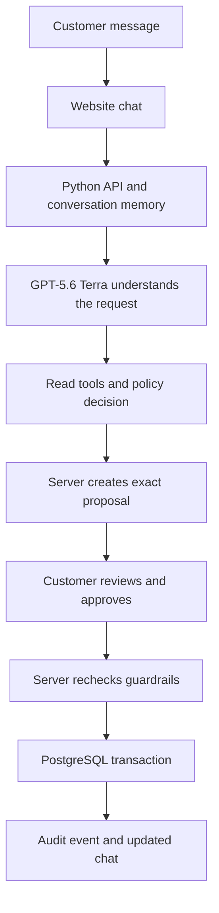

# Cartly Agent Studio

Cartly Agent Studio is a practical example of a customer-support agent that can
understand everyday language while keeping business actions under deterministic
software control.

It is built around a simple rule:

> The language model may understand and propose. The service decides and executes.

The demo uses synthetic Cartly orders and customers. It does not connect to a
real payment provider, courier, or support inbox.

## Why this project exists

Many agent demos stop when a model produces a convincing answer. Customer support
needs more. A refund must use the right amount, go to the right customer, happen
only once, and be approved before money moves.

Cartly shows how to add those controls without giving up a natural-language
chat experience.

## What the agent can do

Customers can write normally about:

- Order status and order history
- Returns and refunds
- Damaged or defective products
- Wrong sizes, colors, products, or quantities
- Change-of-mind returns
- Order cancellation
- Delivery-address changes
- Late-delivery coupons
- Safety issues and requests for a human

The agent verifies the customer, reads the relevant order, checks the policy,
calculates the exact terms, and explains the result. When an action changes data,
the website shows a precise proposal and an approval control.

## A request from start to finish



For example, a customer asking to return an unused kurta causes the agent to:

1. Verify the customer.
2. Read the order and item.
3. Ask for the unused-item confirmation when needed.
4. Calculate the refund from database values.
5. Show the action, amount, method, and timing.
6. Wait for the customer to approve those exact terms.
7. Create the return once, then let the system refund after pickup.

Terra never gets to invent the amount or directly update the database.

## The policy

The locked policy is [`policy.md`](policy.md), currently v0.8. It covers:

- Identity and privacy
- Valid order states and state transitions
- Cancellation and address changes
- Return windows and non-returnable categories
- Damaged, defective, wrong-item, and change-of-mind cases
- Evidence requirements
- Refund timing, methods, shipping, and authority limits
- Recent refund history
- Late-delivery coupons
- Confirmation and escalation

Some important examples:

- Most items can be returned within 10 calendar days; electronics have 7 days.
- Innerwear is normally non-returnable, except for qualifying damage or wrong-item claims.
- Change-of-mind refunds require an unused item and subtract a ₹99 pickup fee.
- COD refunds go to Cartly Wallet.
- A damage refund above ₹2,000 needs a photo uploaded to the order.
- Three or more return or damage refunds in 90 days require escalation.
- A customer must approve the exact action, amount, and refund method.

The policy is supplied to Terra through [`prompts/current.md`](prompts/current.md),
and the server also evaluates it through deterministic Python code.

## Guardrails and safety

Guardrails are checks that can stop an unsafe or invalid action. Cartly uses them
at several layers:

1. **Identity:** account-specific data requires user ID plus matching email or phone.
2. **Ownership:** another customer's order is unavailable, even with a valid ID.
3. **State:** a shipped order cannot be cancelled; a shipped address cannot be changed.
4. **Eligibility:** return windows, categories, evidence, and delivery timing are checked.
5. **Financial accuracy:** amounts and methods come from PostgreSQL values, never chat claims.
6. **Limits:** refund history and the cumulative ₹5,000 authority limit are enforced.
7. **Approval:** a stored proposal must be accepted before a monetary or write action runs.
8. **Freshness:** a new customer message invalidates an old approval.
9. **Consistency:** database locks, unique constraints, and idempotency prevent duplicate actions.
10. **Auditability:** each committed action is written to an append-only hash-chained audit log.

The model can request a proposal, but only the service can execute it. The service
rechecks the order and refund terms immediately before committing the transaction.

## What Terra can and cannot use

The model can call read and decision functions:

| Function | Purpose |
|---|---|
| `verify_user` | Verify the customer. |
| `get_order`, `list_orders` | Read the verified customer's orders. |
| `search_policy` | Retrieve relevant policy text. |
| `check_serviceability` | Check a delivery pincode. |
| `get_refund_history` | Read recent refund history. |
| `check_evidence` | Check whether an order photo exists. |
| `decide_policy` | Ask the deterministic policy engine for an outcome. |
| `propose_action` | Create the exact proposal shown to the customer. |
| `escalate_to_human` | Save a structured human handoff. |

Terra cannot directly call the write operations for address updates, cancellations,
returns, refunds, or coupons. It also cannot call the approval control, complete a
pickup, read hidden scenario truth, use the reference calculator, run SQL, or access
payment and courier systems.

## How the project is organised

| Area | Main files | Responsibility |
|---|---|---|
| Prompt and policy | [`prompts/current.md`](prompts/current.md), [`policy.md`](policy.md) | Product instructions and business rules. |
| Agent | [`service/agent.py`](service/agent.py) | Terra conversation loop, memory, and tool requests. |
| Decisions | [`service/policy.py`](service/policy.py) | Deterministic eligibility and financial decisions. |
| Safety boundary | [`service/core.py`](service/core.py), [`service/engine.py`](service/engine.py) | Proposals, approvals, rechecks, and guarded actions. |
| Tools | [`cartly/tools.py`](cartly/tools.py) | Identity, order, refund, return, coupon, and escalation operations. |
| Storage | [`service/repository.py`](service/repository.py), `service/migrations/` | PostgreSQL state, constraints, transactions, and audit history. |
| API | [`service/api.py`](service/api.py), [`service/web.py`](service/web.py) | HTTP endpoints and safe activity snapshots. |
| Website | [`website/app/page.tsx`](website/app/page.tsx) | Chat, proposals, controls, and visible activity. |
| Evaluations | `simulation/`, `evaluation/`, `scenarios/`, `scenario_truth/` | Simulated customers, answer key, grader, and saved runs. |

The live prototype has a website hosted through Sites, a Python backend on Railway,
and PostgreSQL on Railway. The browser contains only the UI and HTTP forwarding
routes; the OpenAI key and business decisions remain server-side.

## How the evaluations work

The evaluation harness is separate from the product runtime.

1. A scenario describes a customer, goal, hidden facts, behavior, and acceptable database end states.
2. The simulated customer sees only its profile and facts allowed by the semantic fact gate.
3. The agent runs a fresh session using the same tools and policy boundary as the product.
4. An independent reference calculator computes the expected business outcome.
5. The grader compares database changes, amounts, methods, confirmation, escalation, communication, safety, and cost.

The main fixture contains 40 scenarios: 30 development cases and 10 heldout cases.
Heldout cases are kept separate so they can test generalisation rather than prompt
iteration. Every transcript, tool call, model response, and final state is saved.

The scorecard reports pass rate, pass³ across three trials, harmful-action rate,
escalation quality, communication quality, turns, and API cost. Invalid simulator,
runner, judge, or API attempts are reported separately and excluded from agent
quality metrics.

The reference calculator is an evaluation oracle, not an agent tool. This prevents
the agent from seeing its answer key.

## What this demonstrates

Cartly is a small but complete pattern for building safer agents:

- Use a language model for language and intent.
- Keep business rules in inspectable code.
- Calculate money from trusted records.
- Turn writes into explicit proposals.
- Require structured customer approval.
- Recheck conditions at commit time.
- Make retries safe and actions auditable.
- Evaluate against an independent answer key.

It is a prototype, not a production payments or logistics platform. The next
practical steps are real authentication, real payment and courier integrations,
stronger prerequisite-question checks, and larger live evaluation sets.

For implementation details, deployment notes, and historical evaluation records,
see [`docs/technical-architecture.md`](docs/technical-architecture.md).

## Run locally

With dependencies installed:

```sh
.venv-service/bin/python scripts/dev.py --enable-model
```

Then open `http://127.0.0.1:5173`. Model calls require an `OPENAI_API_KEY` in the
server environment. The local demo uses synthetic data and the same Python service
that powers the hosted prototype.
